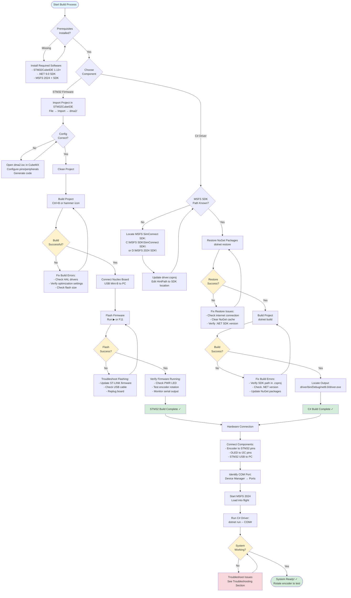

# Build Instructions

This document provides comprehensive instructions for building and running both the STM32 firmware and C# driver components of the autopilot controller system.

## Table of Contents

- [Prerequisites](#prerequisites)
- [Hardware Requirements](#hardware-requirements)
- [Building STM32 Firmware](#building-stm32-firmware)
- [Building C# Driver](#building-c-driver)
- [Hardware Connection](#hardware-connection)
- [Running the System](#running-the-system)
- [Troubleshooting](#troubleshooting)

## Build Process Workflow

The following flowchart provides an overview of the complete build and deployment process for both components:



---

## Prerequisites

### Required Software

#### For STM32 Firmware Development
- **STM32CubeIDE** (version 1.13.0 or later)
  - Download from: [https://www.st.com/en/development-tools/stm32cubeide.html](https://www.st.com/en/development-tools/stm32cubeide.html)
  - Includes integrated compiler, debugger, and STM32CubeMX
  - Free registration required for download

#### For C# Driver Development
- **.NET 9.0 SDK**
  - Download from: [https://dotnet.microsoft.com/download/dotnet/9.0](https://dotnet.microsoft.com/download/dotnet/9.0)
  - Install the SDK, not just the runtime
  - Verify installation: `dotnet --version`

#### For MSFS Integration
- **Microsoft Flight Simulator 2024**
  - Must be installed and runnable
- **MSFS 2024 SimConnect SDK**
  - Typically installed with MSFS 2024
  - Default location: `C:\MSFS SDK\SimConnect SDK\`
  - Alternative locations: Check MSFS installation folder

#### Optional Tools
- **Serial Terminal** (for debugging)
  - PuTTY, Tera Term, or Arduino Serial Monitor
  - Configure for 115200 baud, 8N1, no flow control
- **Git** (for version control)
  - Download from: [https://git-scm.com/](https://git-scm.com/)

---

## Hardware Requirements

### Essential Hardware
1. **STM32F091RC Nucleo Board**
   - Part number: NUCLEO-F091RC
   - Cortex-M0, 48 MHz, 256KB Flash, 32KB RAM
   - Purchase from: ST.com, Mouser, Digi-Key (~$15-20)

2. **Rotary Encoder with Push Button**
   - Incremental quadrature encoder (20-24 detents recommended)
   - Examples: Alps EC11E183440C, Bourns PEC11R, KY-040 module
   - See [PINOUT.md](PINOUT.md) for detailed pinout and wiring

3. **USB Cables**
   - USB Mini-B cable (for STM32 Nucleo board)
   - Powers the board and provides ST-LINK debugging interface

4. **Jumper Wires**
   - 5-6 female-to-male or male-to-male jumper wires
   - For connecting rotary encoder to Nucleo board

### Optional Hardware
- **SSD1306 OLED Display** (128x64, I2C)
  - For visual autopilot status display
  - Connected via I2C (PB6=SCL, PB7=SDA)
- **Breadboard** (for prototyping)
- **External Pull-up Resistors** (4.7kΩ, if needed for long encoder wires)

---

## Building STM32 Firmware

### Step 1: Install STM32CubeIDE

1. Download STM32CubeIDE from ST.com
2. Run the installer and follow the prompts
3. Register/login with ST account when prompted
4. Launch STM32CubeIDE after installation

### Step 2: Import the Firmware Project

1. **Launch STM32CubeIDE**
   - First launch will ask for workspace location (accept default or choose your own)

2. **Import Existing Project**
   - Go to: `File` → `Import...`
   - Select: `General` → `Existing Projects into Workspace`
   - Click `Next`

3. **Select Project Directory**
   - Click `Browse...` next to "Select root directory"
   - Navigate to: `E:\code\autopilotv1\dma2`
   - Check the box next to the project name (should auto-detect)
   - **IMPORTANT:** Do NOT check "Copy projects into workspace"
   - Click `Finish`

4. **Wait for Indexing**
   - STM32CubeIDE will index the project (may take 1-2 minutes)
   - Bottom right corner shows indexing progress

### Step 3: Configure the Project (if needed)

The project should be pre-configured, but verify these settings:

1. **Right-click project** → `Properties`
2. Navigate to: `C/C++ Build` → `Settings`
3. Check:
   - **MCU GCC Compiler** → `Optimization`: `-Og` (debug) or `-O2` (release)
   - **MCU GCC Linker** → `Libraries`: No special libraries needed
4. Click `Apply and Close`

### Step 4: Build the Firmware

1. **Clean the Project** (recommended for first build)
   - Right-click project → `Clean Project`
   - Wait for completion

2. **Build the Project**
   - Click the hammer icon (Build) in the toolbar, or
   - Right-click project → `Build Project`, or
   - Press `Ctrl+B`

3. **Check Build Output**
   - Console window shows build progress
   - Successful build shows:
     ```
     Finished building target: dma2.elf
     arm-none-eabi-size dma2.elf
        text    data     bss     dec     hex filename
       24576     112    2048   26736    6870 dma2.elf
     Finished building: default.size.stdout
     ```

4. **Build Artifacts Location**
   - Output file: `dma2/Debug/dma2.elf`
   - Also generates: `dma2.bin`, `dma2.hex`, `dma2.map`

### Step 5: Flash the Firmware to Nucleo Board

1. **Connect STM32 Nucleo Board**
   - Plug USB Mini-B cable into Nucleo board
   - Connect other end to PC
   - Green LED (PWR) should light up
   - Windows should detect "STM32 STLink" device

2. **Flash via STM32CubeIDE**
   - Click the green "Run" button (▶) in toolbar, or
   - Right-click project → `Run As` → `STM32 C/C++ Application`
   - First time will ask for debug configuration (accept defaults)

3. **Verify Programming**
   - Console shows:
     ```
     STMicroelectronics ST-LINK GDB server
     Target voltage: 3.3V
     Flashing...
     Download verified successfully
     ```
   - Green LED (LD2/PA5) may blink during programming

4. **Alternative: Flash via ST-LINK Utility**
   - Open STM32CubeProgrammer (installed with CubeIDE)
   - Connect via ST-LINK
   - Open file: `dma2/Debug/dma2.elf`
   - Click "Download" button

### Step 6: Verify Firmware is Running

1. **Check Serial Output** (optional)
   - Open serial terminal (PuTTY, Tera Term)
   - Find COM port: Device Manager → Ports (COM & LPT) → "STMicroelectronics Virtual COM Port"
   - Connect: 115200 baud, 8 data bits, no parity, 1 stop bit, no flow control
   - You should see UART debug output (if enabled in firmware)

2. **Test Encoder**
   - Rotate encoder → Should see counter changes in terminal
   - Press encoder button → Should trigger command

---

## Building C# Driver

### Step 1: Install .NET 9.0 SDK

1. **Download .NET 9.0 SDK**
   - Visit: [https://dotnet.microsoft.com/download/dotnet/9.0](https://dotnet.microsoft.com/download/dotnet/9.0)
   - Download the SDK (not Runtime) for your OS

2. **Install SDK**
   - Run the installer
   - Follow the prompts (default settings are fine)

3. **Verify Installation**
   - Open terminal/command prompt
   - Run: `dotnet --version`
   - Should output: `9.0.x` (e.g., `9.0.0`)

### Step 2: Configure MSFS SDK Path

The C# driver references the MSFS SimConnect SDK. You need to configure the path to the SDK DLL.

**Option A: Update the .csproj file (Recommended)**

1. **Locate the MSFS SimConnect SDK**
   - Common locations:
     - `C:\MSFS SDK\SimConnect SDK\lib\managed\Microsoft.FlightSimulator.SimConnect.dll`
     - `D:\MSFS 2024 SDK\SimConnect SDK\lib\managed\Microsoft.FlightSimulator.SimConnect.dll`
     - `C:\Program Files\Microsoft Flight Simulator 2024\SDK\SimConnect SDK\lib\managed\Microsoft.FlightSimulator.SimConnect.dll`

2. **Edit driver.csproj**
   - Open: `E:\code\autopilotv1\driver\driver.csproj` in a text editor
   - Find the `<HintPath>` lines (around lines 17 and 23)
   - Update paths to match your SDK location:
     ```xml
     <Reference Include="Microsoft.FlightSimulator.SimConnect">
       <HintPath>YOUR_PATH_HERE\SimConnect SDK\lib\managed\Microsoft.FlightSimulator.SimConnect.dll</HintPath>
       <Private>true</Private>
     </Reference>
     ```
   - Save the file

**Option B: Use Relative Path (if SDK is in standard location)**

If your SDK is in `C:\MSFS SDK`, the project may work without changes. Otherwise, update as shown above.

**Option C: Use Environment Variable (Advanced)**

1. Set environment variable `MSFS_SDK_PATH` to your SDK directory
2. Update .csproj to use: `$(MSFS_SDK_PATH)\SimConnect SDK\lib\managed\Microsoft.FlightSimulator.SimConnect.dll`

### Step 3: Restore Dependencies

1. **Open Terminal**
   - Navigate to driver directory:
     ```bash
     cd E:\code\autopilotv1\driver
     ```

2. **Restore NuGet Packages**
   ```bash
   dotnet restore
   ```
   - This downloads the `System.IO.Ports` package (version 9.0.10)
   - Output should show:
     ```
     Determining projects to restore...
     Restored E:\code\autopilotv1\driver\driver.csproj (in X ms).
     ```

### Step 4: Build the Driver

1. **Build the Project**
   ```bash
   dotnet build
   ```
   - Compiles the C# code
   - Output shows:
     ```
     Build succeeded.
         0 Warning(s)
         0 Error(s)
     ```

2. **Build Output Location**
   - Executable: `driver/bin/Debug/net9.0/driver.exe`
   - DLLs copied: `Microsoft.FlightSimulator.SimConnect.dll`, `System.IO.Ports.dll`

3. **Build for Release (Optional)**
   ```bash
   dotnet build --configuration Release
   ```
   - Output: `driver/bin/Release/net9.0/driver.exe`
   - Optimized for performance

### Step 5: Troubleshooting Build Issues

**Error: SDK Not Found**
```
error CS0006: Metadata file 'Microsoft.FlightSimulator.SimConnect.dll' could not be found
```
- **Fix:** Update `<HintPath>` in `driver.csproj` to correct SDK location

**Error: .NET SDK Not Found**
```
The command 'dotnet' is not recognized...
```
- **Fix:** Install .NET 9.0 SDK and restart terminal

**Error: Wrong .NET Version**
```
error NETSDK1045: The current .NET SDK does not support targeting .NET 9.0
```
- **Fix:** Update to .NET 9.0 SDK (check with `dotnet --version`)

---

## Hardware Connection

### Step 1: Identify the COM Port

**On Windows:**
1. Open Device Manager (`Win+X` → Device Manager)
2. Expand "Ports (COM & LPT)"
3. Look for "STMicroelectronics Virtual COM Port (COMX)" or "USB Serial Device (COMX)"
4. Note the COM port number (e.g., COM3, COM4)

**On Linux:**
```bash
ls /dev/ttyACM*
# Usually /dev/ttyACM0
```

**On macOS:**
```bash
ls /dev/cu.usbmodem*
# Usually /dev/cu.usbmodemXXXX
```

### Step 2: Connect Rotary Encoder to STM32 Nucleo

Refer to [PINOUT.md](PINOUT.md) for detailed wiring instructions and pin configuration.

**Quick Reference:**

| Function | STM32 Pin | Nucleo Connector | Encoder Pin |
|----------|-----------|------------------|-------------|
| Encoder A | PA0 | CN8 Pin 9 (A0) | CLK / A |
| Encoder B | PA1 | CN8 Pin 10 (A1) | DT / B |
| Button | PA4 | CN8 Pin 11 (A2) | SW |
| Ground | GND | CN8 Pin 6 or 8 | GND |
| Power (optional) | +3.3V | CN8 Pin 4 | VCC |

**Wiring Diagram:**
```
STM32 Nucleo (CN8)          Rotary Encoder
┌────────────────┐          ┌──────────────┐
│  PA0 (A0) ●────┼──────────┤ A (CLK)      │
│  PA1 (A1) ●────┼──────────┤ B (DT)       │
│  PA4 (A2) ●────┼──────────┤ SW (Button)  │
│  GND      ●────┼──────────┤ GND          │
│  +3.3V    ●────┼──────────┤ VCC (opt.)   │
└────────────────┘          └──────────────┘
```

**Notes:**
- Internal pull-ups are enabled on PA6, PA7, BTN_KNOB (no external resistors needed for short wires)
- Add 4.7kΩ external pull-ups if encoder cable is >15cm
- Some encoders don't need VCC connection (passive encoders)
- See [PINOUT.md](PINOUT.md) for complete pin configuration details

### Step 3: Connect STM32 to PC

1. **USB Connection**
   - Plug USB Mini-B cable into Nucleo board (CN1 connector, top of board)
   - Connect to PC USB port
   - Green PWR LED should light up

2. **Verify Connection**
   - STM32 appears as two devices:
     - ST-LINK debugger (for programming)
     - Virtual COM Port (for UART communication)

---

## Running the System

### Step 1: Start Microsoft Flight Simulator 2024

1. **Launch MSFS 2024**
   - Start the simulator and load into a flight (any aircraft)
   - Wait until you're in the cockpit and can control the aircraft

2. **Verify SimConnect is Available**
   - SimConnect starts automatically with MSFS 2024
   - No additional configuration needed

### Step 2: Run the C# Driver

**Method 1: Using dotnet run (Development)**

```bash
cd E:\code\autopilotv1\driver
dotnet run -- COM4
```

Replace `COM4` with your actual COM port from Device Manager.

**Method 2: Using the Compiled Executable**

```bash
cd E:\code\autopilotv1\driver\bin\Debug\net9.0
driver.exe COM4
```

**Method 3: Double-click and provide arguments**

1. Open Command Prompt in `driver\bin\Debug\net9.0`
2. Run: `driver.exe COM4`

### Step 3: Verify System is Working

**Console Output:**
```
MSFS Autopilot Controller
Opening COM4 at 115200 baud...
Connected to STM32 on COM4
Connecting to MSFS SimConnect...
Connected to MSFS SimConnect
Starting receiver...

[Console commands available:]
  led on      - Turn LED on
  led off     - Turn LED off
  ap on       - Engage autopilot
  ap off      - Disengage autopilot
  hdg on      - Activate heading mode
  hdg off     - Deactivate heading mode
  alt on      - Activate altitude mode
  alt off     - Deactivate altitude mode
  vs on       - Activate vertical speed mode
  vs off      - Deactivate vertical speed mode
  exit        - Exit program

Listening for commands from STM32...
```

**Status Indicators:**
- `Connected to MSFS SimConnect` - SimConnect is working
- `Connected to STM32 on COM4` - UART communication is active
- Rotating encoder → Console shows `Received: HDG:DELTA(+1)`
- Pressing encoder button → Console shows button press commands

**Testing:**
1. **Rotate encoder clockwise** → Heading should change in MSFS
2. **Rotate encoder counter-clockwise** → Heading decreases
3. **Press encoder button** → Triggers mode changes
4. **Type `led on`** in console → STM32 onboard LED (LD2) should light up
5. **Type `led off`** in console → LED turns off

### Step 4: Using the Autopilot Controller

**Engaging Autopilot:**
1. In MSFS, engage autopilot (or type `ap on` in driver console)
2. OLED display on STM32 shows "AP ENGAGED"
3. PC sends status sync commands to STM32

**Activating Heading Mode:**
1. Enable heading mode in MSFS (or type `hdg on` in driver console)
2. OLED shows "HDG ACTIVE"
3. Rotate encoder to adjust heading bug

**Activating Altitude Mode:**
1. Enable altitude mode in MSFS (or type `alt on` in driver console)
2. OLED shows "ALT ACTIVE"
3. Rotate encoder to adjust target altitude

**Activating Vertical Speed Mode:**
1. Enable VS mode in MSFS (or type `vs on` in driver console)
2. OLED shows "VS ACTIVE"
3. Rotate encoder to adjust vertical speed

---

## Troubleshooting

Use this decision tree to quickly identify and resolve common issues:

```mermaid
flowchart TD
    Start([System Not Working]) --> Category{What's the<br/>problem?}

    %% Build Issues Path
    Category -->|Build Fails| BuildType{Which<br/>component?}

    BuildType -->|STM32 Firmware| STM32BuildCheck{Error<br/>type?}
    STM32BuildCheck -->|undefined reference| FixHAL[Check HAL drivers included<br/>Properties → Settings → Verify drivers]
    STM32BuildCheck -->|Flash overflow| FixFlash[Enable optimization -O2<br/>Remove unused code<br/>Check flash size]
    STM32BuildCheck -->|Other| STM32Clean[Clean Project<br/>Rebuild from scratch]
    FixHAL --> TestBuild1[Rebuild Project]
    FixFlash --> TestBuild1
    STM32Clean --> TestBuild1
    TestBuild1 --> BuildFixed1{Fixed?}
    BuildFixed1 -->|Yes| Success1([Continue to Flash])
    BuildFixed1 -->|No| CheckDocs1[Review STM32 build logs<br/>Check CubeIDE settings]

    BuildType -->|C# Driver| CSBuildCheck{Error<br/>type?}
    CSBuildCheck -->|SDK not found| FixSDKPath[Update driver.csproj<br/>Edit HintPath to correct SDK location<br/>Run dotnet build]
    CSBuildCheck -->|.NET not found| InstallNET[Install .NET 9.0 SDK<br/>Restart terminal<br/>Verify: dotnet --version]
    CSBuildCheck -->|Wrong .NET version| UpdateNET[Update to .NET 9.0 SDK<br/>Check dotnet --version]
    FixSDKPath --> TestBuild2[dotnet build]
    InstallNET --> TestBuild2
    UpdateNET --> TestBuild2
    TestBuild2 --> BuildFixed2{Fixed?}
    BuildFixed2 -->|Yes| Success2([Continue to Run])
    BuildFixed2 -->|No| CheckDocs2[Review build logs<br/>Verify all dependencies]

    %% Flashing Issues Path
    Category -->|Cannot Flash| FlashCheck{Error<br/>message?}
    FlashCheck -->|No ST-LINK| FixSTLink[Check USB cable<br/>Install ST-LINK drivers<br/>Update ST-LINK firmware:<br/>Help → ST-LINK Upgrade]
    FlashCheck -->|Launch sequence failed| RestartIDE[Unplug USB<br/>Close STM32CubeIDE<br/>Replug USB<br/>Restart IDE]
    FlashCheck -->|Board appears dead| CheckPower[Verify PWR LED on<br/>Try different USB port<br/>Check for shorts<br/>Press RESET button]
    FixSTLink --> TestFlash[Try Flashing Again]
    RestartIDE --> TestFlash
    CheckPower --> TestFlash
    TestFlash --> FlashFixed{Fixed?}
    FlashFixed -->|Yes| Success3([Firmware Flashed ✓])
    FlashFixed -->|No| HardwareIssue[Possible hardware fault<br/>Try different Nucleo board]

    %% Runtime Issues Path
    Category -->|Runtime Issue| RuntimeType{Which<br/>component?}

    RuntimeType -->|COM Port| COMCheck{Error<br/>type?}
    COMCheck -->|Port not found| FindCOM[Check Device Manager<br/>Look for Virtual COM Port<br/>Update COM# in command]
    COMCheck -->|Access denied| ClosePorts[Close other serial terminals<br/>Kill stale driver.exe<br/>Unplug/replug USB]
    FindCOM --> TestCOM[Try Running Driver]
    ClosePorts --> TestCOM
    TestCOM --> COMFixed{Fixed?}
    COMFixed -->|Yes| Success4([Driver Connected ✓])
    COMFixed -->|No| DriverIssue[Check baud rate: 115200<br/>Test with serial terminal]

    RuntimeType -->|SimConnect| SimConnectCheck[Is MSFS running<br/>and in a flight?]
    SimConnectCheck -->|No| StartMSFS[Start MSFS 2024<br/>Load into flight<br/>Unpause game]
    SimConnectCheck -->|Yes| VerifySDK[Verify SimConnect SDK installed<br/>Check Windows Firewall<br/>Update SDK path in .csproj]
    StartMSFS --> TestSimConnect[Try Running Driver]
    VerifySDK --> TestSimConnect
    TestSimConnect --> SimConnectFixed{Fixed?}
    SimConnectFixed -->|Yes| Success5([SimConnect Working ✓])
    SimConnectFixed -->|No| ReinstallSDK[Reinstall MSFS SDK<br/>Rebuild driver]

    RuntimeType -->|No Data from STM32| DataCheck{What's<br/>happening?}
    DataCheck -->|Nothing received| CheckSerial[Verify COM port correct<br/>Press STM32 RESET button<br/>Test with serial terminal<br/>Check baud rate 115200]
    DataCheck -->|Encoder not working| CheckEncoder[Verify encoder wiring:<br/>PA6→A, PA7→B, GND→GND<br/>Add 4.7kΩ pull-ups<br/>Test with multimeter]
    DataCheck -->|Button not working| CheckButton[Verify button wiring:<br/>BTN_KNOB→SW, GND→GND<br/>Check pull-up enabled<br/>Test with multimeter]
    CheckSerial --> TestData[Rotate Encoder]
    CheckEncoder --> TestData
    CheckButton --> TestData
    TestData --> DataFixed{Fixed?}
    DataFixed -->|Yes| Success6([Data Flowing ✓])
    DataFixed -->|No| WiringIssue[Review PINOUT.md<br/>Check all connections<br/>Try different encoder]

    RuntimeType -->|Encoder Issues| EncoderCheck{What's wrong<br/>with encoder?}
    EncoderCheck -->|Wrong direction| SwapPins[Swap A and B connections:<br/>PA6 ↔ PA7]
    EncoderCheck -->|Erratic counting| AddFiltering[Add 4.7kΩ pull-ups<br/>Add 100nF capacitors<br/>Shorten wires <15cm<br/>Move away from EMI sources]
    EncoderCheck -->|Button bouncing| FixBounce[Increase debounce time<br/>Add 100nF capacitor<br/>Check firmware DEBOUNCE_TIME_MS]
    SwapPins --> TestEncoder[Test Encoder]
    AddFiltering --> TestEncoder
    FixBounce --> TestEncoder
    TestEncoder --> EncoderFixed{Fixed?}
    EncoderFixed -->|Yes| Success7([Encoder Working ✓])
    EncoderFixed -->|No| ReplaceEncoder[Try different encoder<br/>May be faulty hardware]

    Category -->|Need Help| Documentation[Check Documentation:<br/>- PROTOCOL.md for protocol details<br/>- PINOUT.md for wiring<br/>- Build logs for error details]

    style Start fill:#f8d7da
    style Success1 fill:#d4edda
    style Success2 fill:#d4edda
    style Success3 fill:#d4edda
    style Success4 fill:#d4edda
    style Success5 fill:#d4edda
    style Success6 fill:#d4edda
    style Success7 fill:#d4edda
    style Category fill:#fff3cd
    style BuildType fill:#e1f5ff
    style CSBuildCheck fill:#e1f5ff
    style STM32BuildCheck fill:#e1f5ff
    style RuntimeType fill:#e1f5ff
    style Documentation fill:#d1ecf1
```



### STM32 Firmware Issues

**Problem: Build fails in STM32CubeIDE**

**Error:** `undefined reference to 'HAL_...'`
- **Cause:** Missing HAL drivers
- **Fix:**
  1. Right-click project → `Properties` → `C/C++ Build` → `Settings`
  2. Verify all HAL drivers are included in build
  3. Clean and rebuild project

**Error:** `region 'FLASH' overflowed`
- **Cause:** Code too large for flash memory
- **Fix:**
  1. Enable optimization: Set `-O2` or `-Os` in compiler settings
  2. Remove debug code or unused features

**Problem: Cannot flash firmware to board**

**Error:** `Error in final launch sequence: Failed to execute MI command: target extended-remote localhost:61234`
- **Fix:**
  1. Unplug and replug USB cable
  2. Close and restart STM32CubeIDE
  3. Update ST-LINK firmware: `Help` → `ST-LINK Upgrade`

**Error:** `No ST-LINK detected`
- **Fix:**
  1. Check USB cable (try a different cable)
  2. Install ST-LINK drivers: [https://www.st.com/en/development-tools/stsw-link009.html](https://www.st.com/en/development-tools/stsw-link009.html)
  3. Verify board is powered (PWR LED on)

**Problem: Board appears dead (no LEDs, no response)**
- **Fix:**
  1. Check power LED (green, should always be on when USB connected)
  2. Try a different USB port/cable
  3. Check for short circuits on encoder wiring
  4. Reset board: Press black RESET button

### C# Driver Issues

**Problem: COM port not found**

**Error:** `The port 'COM4' does not exist.`
- **Fix:**
  1. Check Device Manager for correct COM port number
  2. Verify STM32 is connected via USB
  3. Try unplugging and replugging USB cable
  4. On Linux/macOS: Check permissions (`sudo chmod 666 /dev/ttyACM0`)

**Error:** `Access to the port 'COM4' is denied.`
- **Cause:** Another program is using the port
- **Fix:**
  1. Close other serial terminals (PuTTY, Arduino IDE, etc.)
  2. Kill stale processes: Task Manager → End task on "driver.exe"
  3. Restart the driver

**Problem: SimConnect connection fails**

**Error:** `Failed to connect to SimConnect`
- **Fix:**
  1. Ensure MSFS 2024 is running and you're in a flight
  2. Check MSFS is not paused
  3. Verify SimConnect SDK is installed
  4. Check Windows Firewall isn't blocking SimConnect

**Error:** `Could not load file or assembly 'Microsoft.FlightSimulator.SimConnect'`
- **Cause:** SimConnect DLL not found or wrong path
- **Fix:**
  1. Update `<HintPath>` in `driver.csproj` to correct SDK path
  2. Run `dotnet build` again
  3. Verify DLL is copied to output directory: `driver/bin/Debug/net9.0/`

**Problem: No data received from STM32**

**Symptoms:** Driver runs but shows no encoder movements
- **Fix:**
  1. Check COM port is correct
  2. Verify STM32 firmware is running (press RESET button)
  3. Test with serial terminal to see raw UART output
  4. Check encoder wiring (see [PINOUT.md](PINOUT.md))
  5. Verify baud rate matches (115200 in both firmware and driver)

### Encoder Hardware Issues

**Problem: Encoder not counting**

**Symptoms:** Rotating encoder does nothing
- **Fix:**
  1. Check wiring: PA6 → Encoder A, PA7 → Encoder B, GND → GND
  2. Verify encoder has power (if required): +3.3V → VCC
  3. Test with multimeter: Encoder outputs should toggle between 0V and 3.3V
  4. Enable internal pull-ups in STM32CubeMX (see [PINOUT.md](PINOUT.md))
  5. Try external 4.7kΩ pull-up resistors

**Problem: Encoder counts wrong direction**

**Symptoms:** CW rotation decrements, CCW increments
- **Fix:** Swap A and B wire connections (PA6 ↔ PA7)

**Problem: Erratic counting / random jumps**

**Symptoms:** Encoder counts when not touched, or jumps multiple values
- **Fix:**
  1. Add external 4.7kΩ pull-ups to A and B lines
  2. Shorten encoder wires (keep <15cm)
  3. Add 100nF capacitors between A/B pins and GND (at encoder)
  4. Move encoder away from power lines, motors, EMI sources
  5. Try a different encoder (may be faulty)

**Problem: Button does nothing**

**Symptoms:** Pressing encoder button has no effect
- **Fix:**
  1. Check wiring: BTN_KNOB → Button, GND → GND
  2. Verify pull-up enabled on BTN_KNOB pin (see [PINOUT.md](PINOUT.md))
  3. Test with multimeter: BTN_KNOB should be 3.3V when not pressed, 0V when pressed
  4. Check EXTI interrupt is enabled in NVIC settings

**Problem: Button sends multiple commands (bouncing)**

**Symptoms:** Single press sends 5-10 commands
- **Fix:**
  1. Increase debounce time in firmware: `DEBOUNCE_TIME_MS = 100`
  2. Add 100nF capacitor between BTN_KNOB and GND

---

## Advanced Topics

### Using uv for Python Package Management (Note)

Per the user's CLAUDE.md instructions, use `uv` for Python package management if Python components are added in the future.

Currently, this project uses:
- **C# (.NET 9.0):** Uses `dotnet` CLI and NuGet for packages
- **STM32 (C):** Uses STM32CubeIDE and HAL libraries

### Debugging Tips

**STM32 Debugging:**
- Use STM32CubeIDE built-in debugger
- Set breakpoints in `main.c`
- View live variables in Expressions window
- Use SWV (Serial Wire Viewer) for printf debugging

**C# Debugging:**
- Use Visual Studio or Visual Studio Code
- Set breakpoints in `Receiver2.cs` or `SimConnectManager.cs`
- View UART traffic in Watch window
- Enable verbose logging with console output

**Protocol Debugging:**
- Use Tera Term or PuTTY to view raw UART traffic
- Refer to [PROTOCOL.md](PROTOCOL.md) for frame formats
- Check checksums manually: `0xAA ^ COMMAND ^ OPERAND`

---

## Quick Reference

### Build Commands Summary

**STM32 Firmware:**
```bash
# In STM32CubeIDE:
# 1. Import project from dma2/
# 2. Build Project (Ctrl+B)
# 3. Run (F11) or Debug (F5)
```

**C# Driver:**
```bash
cd E:\code\autopilotv1\driver

# Restore dependencies
dotnet restore

# Build project
dotnet build

# Run application
dotnet run -- COM4

# Or run compiled executable:
bin\Debug\net9.0\driver.exe COM4
```

### File Locations

**STM32 Firmware:**
- Project: `E:\code\autopilotv1\dma2\`
- Main code: `dma2\Core\Src\main.c`
- Build output: `dma2\Debug\dma2.elf`
- Configuration: `dma2\dma2.ioc` (open in STM32CubeMX)

**C# Driver:**
- Project: `E:\code\autopilotv1\driver\`
- Main code: `driver\Receiver2.cs`, `driver\SimConnectManager.cs`
- Build output: `driver\bin\Debug\net9.0\driver.exe`
- Configuration: `driver\driver.csproj`

**Documentation:**
- Protocol specification: `PROTOCOL.md`
- Hardware pinout: `PINOUT.md`
- This guide: `BUILD.md`

---

## Getting Help

**Common Resources:**
- **STM32 Documentation:** [https://www.st.com/en/microcontrollers-microprocessors/stm32f091rc.html](https://www.st.com/en/microcontrollers-microprocessors/stm32f091rc.html)
- **MSFS SimConnect SDK:** Check SDK installation folder for documentation
- **.NET Documentation:** [https://learn.microsoft.com/en-us/dotnet/](https://learn.microsoft.com/en-us/dotnet/)

**Project Documentation:**
- Read `PROTOCOL.md` for communication protocol details
- Read `PINOUT.md` for complete hardware pinout and wiring
- Check `CLAUDE.md` for project-specific instructions

**Troubleshooting Steps:**
1. Verify all hardware connections (see Hardware Connection section)
2. Check COM port in Device Manager (Windows) or `ls /dev/tty*` (Linux/macOS)
3. Confirm MSFS 2024 is running and in a flight
4. Test UART with a serial terminal to verify STM32 is transmitting
5. Check driver console for error messages
6. Rebuild firmware and driver from clean state

---

**Version:** 1.0
**Last Updated:** 2025-11-11
**Maintainer:** Project Contributors

For issues or questions, refer to the documentation files in the repository or check the commit history for recent changes.
