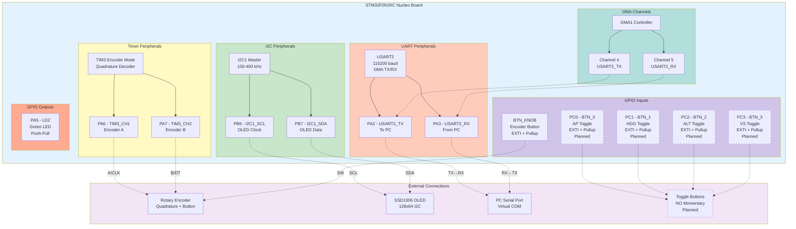

# Hardware Pinout Reference

**Single Source of Truth for STM32 Pin Connections**

This document defines all pin connections and settings for the MSFS Autopilot Hardware Controller using the STM32F091RC Nucleo board.

## Quick Reference

### Component Connections

| Component | STM32 Pin | Arduino Header | Signal Name | Notes |
|-----------|-----------|----------------|-------------|-------|
| **Rotary Encoder A** | PA6 | D12 | TIM3_CH1 | Quadrature channel A |
| **Rotary Encoder B** | PA7 | D11 | TIM3_CH2 | Quadrature channel B |
| **Encoder Button** | BTN_KNOB | - | GPIO_EXTI | Mode toggle button |
| **OLED Display SCL** | PB6 | D10 | I2C1_SCL | I2C clock |
| **OLED Display SDA** | PB7 | - | I2C1_SDA | I2C data |
| **UART TX (to PC)** | PA2 | - | USART2_TX | Serial transmit |
| **UART RX (from PC)** | PA3 | - | USART2_RX | Serial receive |
| **LED (onboard)** | PA5 | D13 | LD2 | Green LED |
| **Toggle Buttons** | PC0-PC3 | - | GPIO_EXTI | Planned buttons |
| **Ground** | GND | GND | GND | Common ground |
| **Power** | +3.3V | +3.3V | VCC | 3.3V supply |

### Pin Configuration Overview Diagram

The following diagram visualizes how STM32 pins are organized by peripheral and function:



**Legend:**
- **Solid boxes**: Implemented and active
- **Dashed boxes**: Planned but not yet implemented
- **Solid arrows**: Internal connections
- **Dotted arrows**: External wiring connections

---

## Detailed Pin Configuration

### Rotary Encoder

**PA6 - Encoder Channel A (TIM3_CH1)**
- **Mode:** Alternate Function (TIM3_CH1)
- **GPIO Mode:** Alternate Function Push-Pull
- **Pull-up/Pull-down:** Pull-up enabled
- **Speed:** High
- **Function:** Hardware quadrature decoder input A
- **User Label:** `KNOB1_A` or `ENC_A`

**PA7 - Encoder Channel B (TIM3_CH2)**
- **Mode:** Alternate Function (TIM3_CH2)
- **GPIO Mode:** Alternate Function Push-Pull
- **Pull-up/Pull-down:** Pull-up enabled
- **Speed:** High
- **Function:** Hardware quadrature decoder input B
- **User Label:** `KNOB1_B` or `ENC_B`

**BTN_KNOB - Encoder Push Button**
- **Mode:** GPIO_EXTI (External Interrupt)
- **GPIO Mode:** External Interrupt Mode with Falling Edge Trigger
- **Pull-up/Pull-down:** Pull-up enabled
- **Function:** Mode toggle button (HDG/ALT/VS)
- **Debounce:** 200ms in software
- **User Label:** `BTN_KNOB` or `ENC_BTN`

**TIM3 Configuration:**
- **Mode:** Encoder Mode (Combined Channels)
- **Encoder Mode:** TI1 and TI2 (4x resolution)
- **Counter Period:** 65535 (0xFFFF)
- **Prescaler:** 0 (no prescaling)
- **Auto-reload:** Maximum value
- **Function:** Hardware quadrature counting with automatic direction detection

---

### OLED Display (SSD1306)

**PB6 - I2C1 Clock (SCL)**
- **Mode:** Alternate Function (I2C1_SCL)
- **GPIO Mode:** Alternate Function Open-Drain
- **Pull-up/Pull-down:** Pull-up enabled
- **Speed:** High
- **Function:** I2C clock line for OLED display
- **User Label:** `I2C1_SCL`

**PB7 - I2C1 Data (SDA)**
- **Mode:** Alternate Function (I2C1_SDA)
- **GPIO Mode:** Alternate Function Open-Drain
- **Pull-up/Pull-down:** Pull-up enabled
- **Speed:** High
- **Function:** I2C data line for OLED display
- **User Label:** `I2C1_SDA`

**I2C1 Configuration:**
- **Mode:** I2C Master
- **Speed:** Standard Mode (100 kHz) or Fast Mode (400 kHz)
- **Addressing:** 7-bit
- **I2C Address:** 0x3C or 0x3D (depends on OLED module)
- **DMA:** Optional (not required for display updates)

---

### UART Communication (PC Connection)

**PA2 - USART2 TX**
- **Mode:** Alternate Function (USART2_TX)
- **GPIO Mode:** Alternate Function Push-Pull
- **Pull-up/Pull-down:** None
- **Speed:** High
- **Function:** Serial transmit to PC
- **User Label:** `USART2_TX`

**PA3 - USART2 RX**
- **Mode:** Alternate Function (USART2_RX)
- **GPIO Mode:** Alternate Function Push-Pull
- **Pull-up/Pull-down:** None
- **Speed:** High
- **Function:** Serial receive from PC
- **User Label:** `USART2_RX`

**USART2 Configuration:**
- **Baud Rate:** 115200
- **Word Length:** 8 bits (including parity)
- **Parity:** None
- **Stop Bits:** 1
- **Data Direction:** Transmit & Receive
- **Over Sampling:** 16 samples
- **Hardware Flow Control:** None
- **DMA:** Enabled on both TX (DMA1 Channel 4) and RX (DMA1 Channel 5)

---

### Toggle Buttons (Planned)

**PC0 - Button 0 (AP Toggle)**
- **Mode:** GPIO_EXTI0 (planned)
- **GPIO Mode:** External Interrupt, Falling Edge
- **Pull-up/Pull-down:** Pull-up enabled
- **Function:** Autopilot master toggle
- **Command:** BTN:AP_TOGGLE (0x50)
- **Status:** Not yet implemented

**PC1 - Button 1 (HDG Toggle)**
- **Mode:** GPIO_EXTI1 (planned)
- **GPIO Mode:** External Interrupt, Falling Edge
- **Pull-up/Pull-down:** Pull-up enabled
- **Function:** Heading mode toggle
- **Command:** BTN:HDG_TOGGLE (0x51)
- **Status:** Not yet implemented

**PC2 - Button 2 (ALT Toggle)**
- **Mode:** GPIO_EXTI2 (planned)
- **GPIO Mode:** External Interrupt, Falling Edge
- **Pull-up/Pull-down:** Pull-up enabled
- **Function:** Altitude mode toggle
- **Command:** BTN:ALT_TOGGLE (0x53)
- **Status:** Not yet implemented

**PC3 - Button 3 (VS Toggle)**
- **Mode:** GPIO_EXTI3 (planned)
- **GPIO Mode:** External Interrupt, Falling Edge
- **Pull-up/Pull-down:** Pull-up enabled
- **Function:** Vertical speed mode toggle
- **Command:** BTN:VS_TOGGLE (0x52)
- **Status:** Not yet implemented

---

### Onboard Components

**PA5 - LD2 (Green LED)**
- **Mode:** GPIO Output
- **GPIO Mode:** Output Push-Pull
- **Pull-up/Pull-down:** None
- **Speed:** Low
- **Function:** Onboard green LED (user controllable)
- **User Label:** `LD2`

**PC13 - B1 (Blue Button)**
- **Mode:** GPIO Input
- **GPIO Mode:** Input with Rising Edge Interrupt
- **Pull-up/Pull-down:** None (external pull-down)
- **Function:** Onboard user button (not currently used)
- **User Label:** `B1`

---

## Wiring Diagrams

### Rotary Encoder Wiring

```
STM32 Nucleo (CN9/CN10)         Rotary Encoder Module
┌─────────────────┐             ┌──────────────────┐
│                 │             │                  │
│  PA6 (D12) ●────┼─────────────┤ CLK / A          │
│                 │             │                  │
│  PA7 (D11) ●────┼─────────────┤ DT / B           │
│                 │             │                  │
│  BTN_KNOB  ●────┼─────────────┤ SW / Button      │
│                 │             │                  │
│  GND       ●────┼─────────────┤ GND / -          │
│                 │             │                  │
│  +3.3V     ●────┼─────────────┤ + / VCC          │
│                 │             │  (optional)      │
└─────────────────┘             └──────────────────┘
```

**Notes:**
- Internal pull-ups enabled on PA6, PA7, and BTN_KNOB
- External pull-ups (4.7kΩ) recommended for cables longer than 15cm
- VCC connection may not be needed for passive encoders

---

### OLED Display Wiring

```
STM32 Nucleo (CN10)             SSD1306 OLED Display
┌─────────────────┐             ┌──────────────────┐
│                 │             │                  │
│  PB6 (D10) ●────┼─────────────┤ SCL              │
│                 │             │                  │
│  PB7       ●────┼─────────────┤ SDA              │
│                 │             │                  │
│  +3.3V     ●────┼─────────────┤ VCC              │
│                 │             │                  │
│  GND       ●────┼─────────────┤ GND              │
│                 │             │                  │
└─────────────────┘             └──────────────────┘
```

**Notes:**
- Standard 0.96" or 1.3" SSD1306 OLED modules
- I2C address typically 0x3C (sometimes 0x3D)
- Internal pull-ups sufficient for short cables (<10cm)

---

### Toggle Buttons Wiring (Planned)

```
STM32 Nucleo (CN7)              Push Buttons
┌─────────────────┐
│                 │             ┌───┐
│  PC0       ●────┼─────────────┤ ● │ Button 0 (AP)
│                 │             └───┘
│                 │             ┌───┐
│  PC1       ●────┼─────────────┤ ● │ Button 1 (HDG)
│                 │             └───┘
│                 │             ┌───┐
│  PC2       ●────┼─────────────┤ ● │ Button 2 (ALT)
│                 │             └───┘
│                 │             ┌───┐
│  PC3       ●────┼─────────────┤ ● │ Button 3 (VS)
│                 │             └───┘
│                 │               │
│  GND       ●────┼───────────────┴─── Common GND
│                 │
└─────────────────┘
```

**Notes:**
- Buttons connect pin to GND when pressed (active low)
- Internal pull-ups enabled on all button pins
- 50-100ms software debouncing recommended

---

## Physical Connector Locations

### CN8 (Left Side - Analog Pins)
```
     1  [NC]        ●  ●  [IOREF]     2
     3  [RESET]     ●  ●  [+3.3V]     4  ← Power
     5  [+5V]       ●  ●  [GND]       6  ← Ground
     7  [GND]       ●  ●  [GND]       8
     9  [VIN]       ●  ●  [NC]        10
```

### CN9 (Right Side - Digital Pins)
```
     1  [D8]        ●  ●  [D7]        2
     3  [D6]        ●  ●  [D5]        3
     4  [D4]        ●  ●  [D3]        4
     5  [D2]        ●  ●  [D1/TX]     6
     7  [D0/RX]     ●  ●  [GND]       8
```

### CN10 (Right Side - More Digital Pins)
```
     1  [D15]       ●  ●  [D14]       2
     3  [AREF]      ●  ●  [GND]       4
     5  [D13/PA5]   ●  ●  [D12/PA6]   6  ← Encoder A
     7  [D11/PA7]   ●  ●  [D10/PB6]   8  ← Encoder B, OLED SCL
     9  [D9]        ●  ●  [D8]        10
```

### CN7 (Left Side - More Analog Pins)
```
     1  [PC10]      ●  ●  [PC11]      2
     3  [PC12]      ●  ●  [PD2]       4
     5  [VDD]       ●  ●  [E5V]       6
     7  [BOOT0]     ●  ●  [GND]       8
     9  [NC]        ●  ●  [NC]        10
    11  [IOREF]     ●  ●  [NRST]      12
    13  [PC13]      ●  ●  [PC14]      14
    15  [PC15]      ●  ●  [PC0]       16  ← Button 0
    17  [PC1]       ●  ●  [PC2]       18  ← Button 1, 2
    19  [PC3]       ●  ●  [PA0]       20  ← Button 3
```

---

## Pull-up Resistor Configuration

### Internal Pull-ups (Already Enabled)
All input pins have internal pull-ups enabled (~40kΩ typical):
- PA6 (Encoder A)
- PA7 (Encoder B)
- BTN_KNOB (Encoder button)
- PC0-PC3 (Toggle buttons, when implemented)

### External Pull-ups (Optional)
Add external 4.7kΩ pull-ups in these cases:
- Encoder cable length > 15cm
- Experiencing erratic counting or missed steps
- Noisy electrical environment
- Long wires to buttons

**External Pull-up Schematic:**
```
        +3.3V
          │
         ┌┴┐
         │ │  4.7kΩ
         └┬┘
          ├──────── To PA6 (Encoder A)
          │
         ┌┴┐
         │ │  4.7kΩ
         └┬┘
          └──────── To PA7 (Encoder B)
```

---

## STM32CubeMX Configuration Checklist

When configuring the project in STM32CubeMX:

### Pinout & Configuration

**Timers:**
- [ ] TIM3: Set to "Encoder Mode" with "TI1 and TI2"
- [ ] TIM3 Counter Period: 65535
- [ ] TIM3 Prescaler: 0

**Communication:**
- [ ] USART2: Mode = Asynchronous, Baud = 115200
- [ ] I2C1: Mode = I2C, Speed = 400000 Hz (Fast Mode)

**GPIO:**
- [ ] PA6: TIM3_CH1 with pull-up
- [ ] PA7: TIM3_CH2 with pull-up
- [ ] BTN_KNOB: GPIO_EXTI with falling edge, pull-up
- [ ] PB6: I2C1_SCL with pull-up
- [ ] PB7: I2C1_SDA with pull-up
- [ ] PA2: USART2_TX
- [ ] PA3: USART2_RX
- [ ] PA5: GPIO_Output (LED)

**DMA:**
- [ ] USART2_TX: DMA1 Channel 4, Memory to Peripheral
- [ ] USART2_RX: DMA1 Channel 5, Peripheral to Memory

**NVIC:**
- [ ] Enable EXTI interrupts for button(s)
- [ ] Enable DMA1 Channel 4 interrupt
- [ ] Enable DMA1 Channel 5 interrupt
- [ ] Enable USART2 global interrupt

### Clock Configuration
- [ ] System Clock: 48 MHz (HSI48 recommended)
- [ ] APB1 Peripheral Clock: 48 MHz

---

## Electrical Specifications

### GPIO Voltage Levels
- **Logic High (VIH):** > 2.0V (typ. 3.3V)
- **Logic Low (VIL):** < 0.8V (typ. 0V)
- **Output High (VOH):** > 2.4V @ 8mA
- **Output Low (VOL):** < 0.4V @ 8mA

### Current Limits
- **Maximum per pin:** 25mA
- **Maximum total GPIO:** 120mA
- **3.3V supply output:** 150mA max from Nucleo board

### Input Protection
- All GPIO pins have ESD protection diodes
- Do not exceed VDD + 0.3V on any pin
- Do not exceed -0.3V on any pin

---

## Hardware Compatibility

### Supported Encoders
Any incremental quadrature rotary encoder with:
- Voltage: 3.3V or 5V tolerant
- Output: Open-drain or open-collector (A, B channels)
- Detents: 12-30 per revolution (20-24 recommended)
- Push button: Normally open (NO)

**Tested Models:**
- Alps EC11E183440C (20 detents)
- Bourns PEC11R-4215F-S0024 (24 detents)
- Generic KY-040 modules

### Supported OLED Displays
Any SSD1306-compatible OLED with:
- Resolution: 128x64 pixels
- Interface: I2C only (SPI not supported)
- Voltage: 3.3V or 5V tolerant
- I2C Address: 0x3C or 0x3D

**Tested Models:**
- 0.96" I2C OLED (common on Amazon/AliExpress)
- 1.3" I2C OLED (SH1106 driver also compatible)

---

## Troubleshooting

### Encoder Not Working
1. **Check pull-ups:** Verify PA6 and PA7 configured with pull-up in CubeMX
2. **Verify TIM3:** Ensure TIM3 is in "Encoder Mode TI1 and TI2"
3. **Check wiring:** Use multimeter to verify continuity
4. **Test signals:** PA6 and PA7 should idle at 3.3V, pulse to 0V when rotating

### OLED Display Not Working
1. **Check I2C address:** Try both 0x3C and 0x3D
2. **Verify pull-ups:** PB6 and PB7 should have pull-up enabled
3. **Test I2C:** Use I2C scanner code to detect device
4. **Check power:** OLED VCC should measure 3.3V

### UART Not Communicating
1. **Check COM port:** Verify correct port in Device Manager
2. **Verify baud rate:** Must be 115200 on both sides
3. **Check cable:** USB cable must support data (not just power)
4. **Test loopback:** Short PA2 and PA3 to test UART hardware

---

## Version History

| Version | Date | Changes |
|---------|------|---------|
| 1.0 | 2025-11-11 | Initial pinout documentation |

---

**Note:** This document reflects the current hardware configuration. For protocol details, see [PROTOCOL.md](PROTOCOL.md). For build instructions, see [BUILD.md](BUILD.md).
