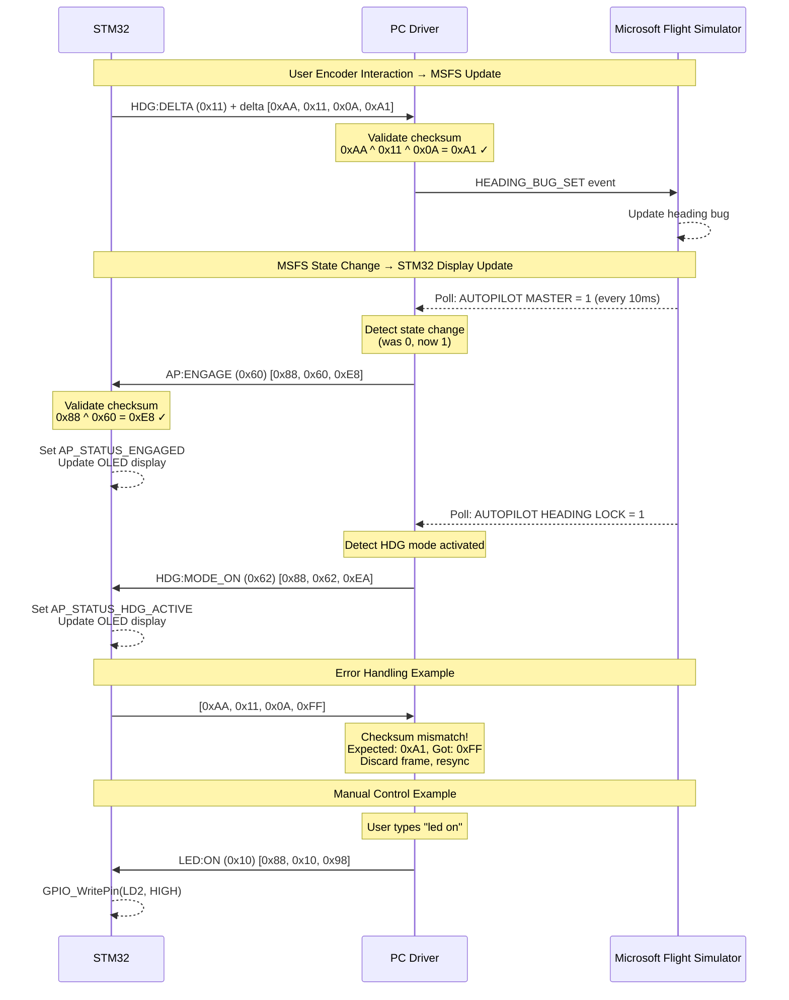
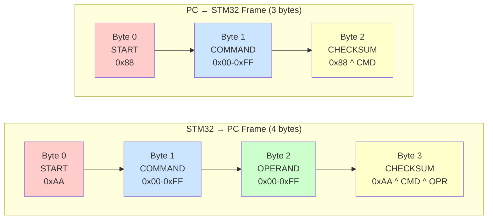
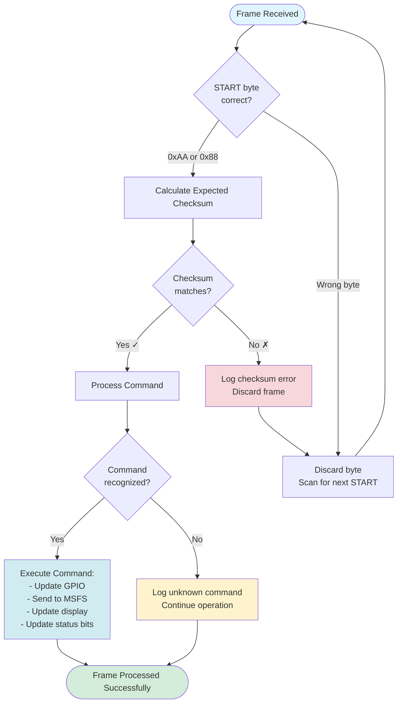
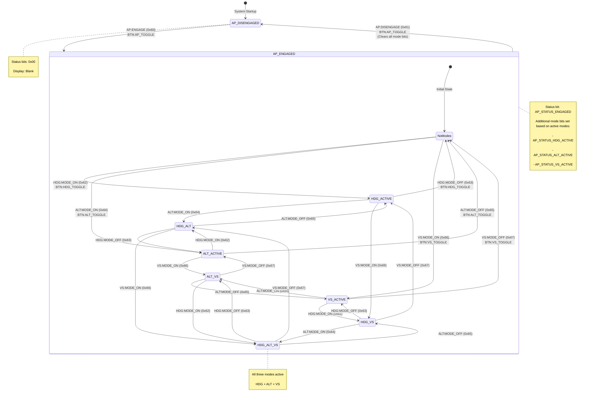
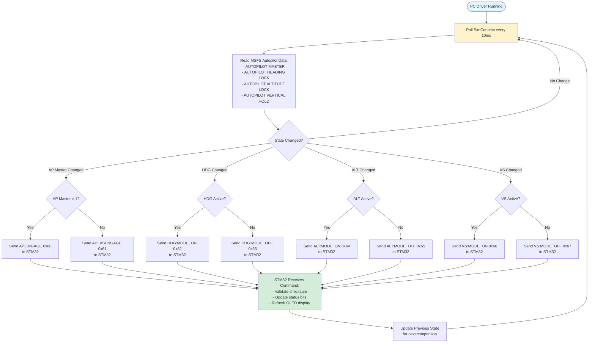
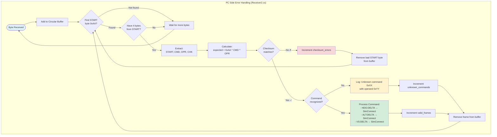
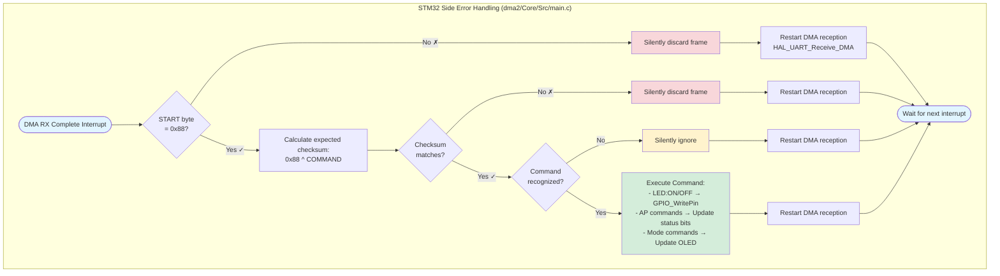

# UART Communication Protocol

## Overview
This document describes the bidirectional binary protocol used for STM32 ↔ PC communication over UART. The system uses two separate frame formats depending on direction:
- **STM32 → PC**: 4-byte frames (START = `0xAA`)
- **PC → STM32**: 3-byte frames (START = `0x88`)

### Communication Protocol Flow

The following diagram illustrates the typical message exchange patterns between STM32, PC driver, and MSFS:



## Protocol Specification

### Frame Structure

#### STM32 → PC (4-byte frames)
Each message from STM32 to PC consists of exactly 4 bytes:

```
Byte 0: START    = 0xAA (frame synchronization marker)
Byte 1: COMMAND  = 0x00-0xFF (command identifier)
Byte 2: OPERAND  = 0x00-0xFF (command parameter)
Byte 3: CHECKSUM = START ^ COMMAND ^ OPERAND (XOR checksum)
```

#### PC → STM32 (3-byte frames)
Each message from PC to STM32 consists of exactly 3 bytes:

```
Byte 0: START    = 0x88 (frame synchronization marker)
Byte 1: COMMAND  = 0x00-0xFF (command identifier)
Byte 2: CHECKSUM = START ^ COMMAND (XOR checksum)
```

### Checksum Calculation

**For STM32 → PC (4-byte frames):**
```c
checksum = 0xAA ^ command ^ operand
```

**For PC → STM32 (3-byte frames):**
```c
checksum = 0x88 ^ command
```

This provides fast error detection with minimal computational overhead.

### Example Frames

**STM32 → PC (4-byte):**
```
Command: HDG:DELTA with delta = +5
Bytes: [0xAA, 0x11, 0x05, 0xAE]
       [START][CMD ][OPR ][CHK ]

Checksum: 0xAA ^ 0x11 ^ 0x05 = 0xAE
```

**PC → STM32 (3-byte):**
```
Command: LED_ON
Bytes: [0x88, 0x10, 0x98]
       [START][CMD ][CHK ]

Checksum: 0x88 ^ 0x10 = 0x98
```

### Frame Structure & Validation Visualization

The following diagrams illustrate the binary frame formats and validation process for both communication directions:





## Command Set

### STM32 → PC Commands (4-byte frames, START = 0xAA)

#### HDG:DELTA (0x11)
Set heading delta (increment/decrement) via rotary encoder.

- **Command byte**: `0x11`
- **Operand**: Signed 8-bit integer (-128 to +127)
  - Positive values: increment heading
  - Negative values: decrement heading
  - Number of mechanical clicks (not raw counts)
- **Status**: ✅ Implemented (rotary encoder, dma2/Core/Src/main.c:348)
- **Examples**:
  - Delta +10: `[0xAA, 0x11, 0x0A, 0xA1]`
  - Delta -5: `[0xAA, 0x11, 0xFB, 0x40]` (0xFB = -5 in two's complement)
  - Delta +127: `[0xAA, 0x11, 0x7F, 0x24]`

#### ALT:DELTA (0x21)
Set altitude delta (increment/decrement) via rotary encoder.

- **Command byte**: `0x21`
- **Operand**: Signed 8-bit integer (-128 to +127)
  - Positive values: increment altitude
  - Negative values: decrement altitude
  - Number of mechanical clicks (not raw counts)
- **Status**: ✅ Implemented (rotary encoder, dma2/Core/Src/main.c:348)
- **Examples**:
  - Delta +10: `[0xAA, 0x21, 0x0A, 0x81]`
  - Delta -5: `[0xAA, 0x21, 0xFB, 0x70]` (0xFB = -5 in two's complement)
  - Delta +50: `[0xAA, 0x21, 0x32, 0x99]`

#### VS:DELTA (0x31)
Set vertical speed delta (increment/decrement) via rotary encoder.

- **Command byte**: `0x31`
- **Operand**: Signed 8-bit integer (-128 to +127)
  - Positive values: increment vertical speed
  - Negative values: decrement vertical speed
  - Number of mechanical clicks (not raw counts)
- **Status**: ✅ Implemented (rotary encoder, dma2/Core/Src/main.c:348)
- **Examples**:
  - Delta +10: `[0xAA, 0x31, 0x0A, 0x91]`
  - Delta -5: `[0xAA, 0x31, 0xFB, 0x60]` (0xFB = -5 in two's complement)
  - Delta +100: `[0xAA, 0x31, 0x64, 0xFF]`

#### BARO:DELTA (0x41)
Set barometric pressure delta (increment/decrement) via rotary encoder.

- **Command byte**: `0x41`
- **Operand**: Signed 8-bit integer (-128 to +127)
  - Positive values: increment barometric pressure
  - Negative values: decrement barometric pressure
  - Number of mechanical clicks (not raw counts)
- **Status**: ⚠️ Planned (not yet implemented in STM32)
- **Examples**:
  - Delta +10: `[0xAA, 0x41, 0x0A, 0xE1]`
  - Delta -5: `[0xAA, 0x41, 0xFB, 0x10]` (0xFB = -5 in two's complement)

#### BTN:AP_TOGGLE (0x50)
Autopilot mode toggle button pressed.

- **Command byte**: `0x50`
- **Operand**: Always `0x00` (unused)
- **Status**: ⚠️ Planned (not yet implemented in STM32)
- **Example**: `[0xAA, 0x50, 0x00, 0xFA]`

#### BTN:HDG_TOGGLE (0x51)
Heading mode toggle button pressed.

- **Command byte**: `0x51`
- **Operand**: Always `0x00` (unused)
- **Status**: ⚠️ Planned (not yet implemented in STM32)
- **Example**: `[0xAA, 0x51, 0x00, 0xFB]`

#### BTN:VS_TOGGLE (0x52)
Vertical speed mode toggle button pressed.

- **Command byte**: `0x52`
- **Operand**: Always `0x00` (unused)
- **Status**: ⚠️ Planned (not yet implemented in STM32)
- **Example**: `[0xAA, 0x52, 0x00, 0xF8]`

#### BTN:ALT_TOGGLE (0x53)
Altitude mode toggle button pressed.

- **Command byte**: `0x53`
- **Operand**: Always `0x00` (unused)
- **Status**: ⚠️ Planned (not yet implemented in STM32)
- **Example**: `[0xAA, 0x53, 0x00, 0xF9]`

### PC → STM32 Commands (3-byte frames, START = 0x88)

#### LED:ON (0x10)
Turn on the onboard LED (LD2).

- **Command byte**: `0x10`
- **Status**: ✅ Implemented (dma2/Core/Src/main.c)
- **Example**: `[0x88, 0x10, 0x98]`
- **Checksum**: `0x88 ^ 0x10 = 0x98`

#### LED:OFF (0x11)
Turn off the onboard LED (LD2).

- **Command byte**: `0x11`
- **Status**: ✅ Implemented (dma2/Core/Src/main.c)
- **Example**: `[0x88, 0x11, 0x99]`
- **Checksum**: `0x88 ^ 0x11 = 0x99`

#### AP:ENGAGE (0x60)
Engage the autopilot system.

- **Command byte**: `0x60`
- **Status**: ✅ Implemented (STM32: dma2/Core/Src/main.c, PC: driver/Receiver2.cs, SimConnect: driver/SimConnectManager.cs)
- **Example**: `[0x88, 0x60, 0xE8]`
- **Checksum**: `0x88 ^ 0x60 = 0xE8`
- **Effect**: Sets AP_STATUS_ENGAGED bit, updates OLED display
- **Auto-sync**: PC monitors MSFS `AUTOPILOT MASTER` and sends this command when AP engages

#### AP:DISENGAGE (0x61)
Disengage the autopilot system (clears all active modes).

- **Command byte**: `0x61`
- **Status**: ✅ Implemented (STM32: dma2/Core/Src/main.c, PC: driver/Receiver2.cs, SimConnect: driver/SimConnectManager.cs)
- **Example**: `[0x88, 0x61, 0xE9]`
- **Checksum**: `0x88 ^ 0x61 = 0xE9`
- **Effect**: Clears all AP status bits, blanks OLED display
- **Auto-sync**: PC monitors MSFS `AUTOPILOT MASTER` and sends this command when AP disengages

#### HDG:MODE_ON (0x62)
Activate heading mode.

- **Command byte**: `0x62`
- **Status**: ✅ Implemented (STM32: dma2/Core/Src/main.c, PC: driver/Receiver2.cs, SimConnect: driver/SimConnectManager.cs)
- **Example**: `[0x88, 0x62, 0xEA]`
- **Checksum**: `0x88 ^ 0x62 = 0xEA`
- **Effect**: Sets AP_STATUS_HDG_ACTIVE bit, updates display
- **Auto-sync**: PC monitors MSFS `AUTOPILOT HEADING LOCK` and sends this command when HDG mode activates

#### HDG:MODE_OFF (0x63)
Deactivate heading mode.

- **Command byte**: `0x63`
- **Status**: ✅ Implemented (STM32: dma2/Core/Src/main.c, PC: driver/Receiver2.cs, SimConnect: driver/SimConnectManager.cs)
- **Example**: `[0x88, 0x63, 0xEB]`
- **Checksum**: `0x88 ^ 0x63 = 0xEB`
- **Effect**: Clears AP_STATUS_HDG_ACTIVE bit, updates display
- **Auto-sync**: PC monitors MSFS `AUTOPILOT HEADING LOCK` and sends this command when HDG mode deactivates

#### ALT:MODE_ON (0x64)
Activate altitude mode.

- **Command byte**: `0x64`
- **Status**: ✅ Implemented (STM32: dma2/Core/Src/main.c, PC: driver/Receiver2.cs, SimConnect: driver/SimConnectManager.cs)
- **Example**: `[0x88, 0x64, 0xEC]`
- **Checksum**: `0x88 ^ 0x64 = 0xEC`
- **Effect**: Sets AP_STATUS_ALT_ACTIVE bit, updates display
- **Auto-sync**: PC monitors MSFS `AUTOPILOT ALTITUDE LOCK` and sends this command when ALT mode activates

#### ALT:MODE_OFF (0x65)
Deactivate altitude mode.

- **Command byte**: `0x65`
- **Status**: ✅ Implemented (STM32: dma2/Core/Src/main.c, PC: driver/Receiver2.cs, SimConnect: driver/SimConnectManager.cs)
- **Example**: `[0x88, 0x65, 0xED]`
- **Checksum**: `0x88 ^ 0x65 = 0xED`
- **Effect**: Clears AP_STATUS_ALT_ACTIVE bit, updates display
- **Auto-sync**: PC monitors MSFS `AUTOPILOT ALTITUDE LOCK` and sends this command when ALT mode deactivates

#### VS:MODE_ON (0x66)
Activate vertical speed mode.

- **Command byte**: `0x66`
- **Status**: ✅ Implemented (STM32: dma2/Core/Src/main.c, PC: driver/Receiver2.cs, SimConnect: driver/SimConnectManager.cs)
- **Example**: `[0x88, 0x66, 0xEE]`
- **Checksum**: `0x88 ^ 0x66 = 0xEE`
- **Effect**: Sets AP_STATUS_VS_ACTIVE bit, updates display
- **Auto-sync**: PC monitors MSFS `AUTOPILOT VERTICAL HOLD` and sends this command when VS mode activates

#### VS:MODE_OFF (0x67)
Deactivate vertical speed mode.

- **Command byte**: `0x67`
- **Status**: ✅ Implemented (STM32: dma2/Core/Src/main.c, PC: driver/Receiver2.cs, SimConnect: driver/SimConnectManager.cs)
- **Example**: `[0x88, 0x67, 0xEF]`
- **Checksum**: `0x88 ^ 0x67 = 0xEF`
- **Effect**: Clears AP_STATUS_VS_ACTIVE bit, updates display
- **Auto-sync**: PC monitors MSFS `AUTOPILOT VERTICAL HOLD` and sends this command when VS mode deactivates

## Autopilot State Machine

The autopilot system maintains multiple status bits that track the current operational state. The following state diagram shows valid states and transitions:



### STM32 Status Bits

The STM32 firmware tracks autopilot state using the following status bits (defined in `dma2/Core/Src/main.c`):

- `AP_STATUS_ENGAGED` (bit 0): Autopilot master engaged
- `AP_STATUS_HDG_ACTIVE` (bit 1): Heading mode active
- `AP_STATUS_ALT_ACTIVE` (bit 2): Altitude hold mode active
- `AP_STATUS_VS_ACTIVE` (bit 3): Vertical speed mode active

The OLED display updates based on these status bits, showing which modes are currently active.

## Implementation Notes

### STM32 Implementation (dma2/Core/Src/main.c)

**Transmit (STM32 → PC):**
- Uses `HAL_UART_Transmit_DMA()` for non-blocking transmission
- Each button has its own dedicated 4-byte DMA buffer to prevent race conditions
- Checksum calculated before sending: `START ^ COMMAND ^ OPERAND`
- Button polling in main loop (lines 213-220)

**Receive (PC → STM32):**
- Uses `HAL_UART_Receive_DMA()` with 3-byte buffer
- Callback function: `HAL_UART_RxCpltCallback()` (lines 434-467)
- Validates START byte (`0x88`) and checksum before processing
- Controls GPIO pins (LED ON/OFF) and updates OLED display
- Automatically restarts DMA reception after each frame

### PC/C# Implementation (driver/Receiver2.cs)

**Receive (STM32 → PC):**
- Uses async reads: `SerialPort.BaseStream.ReadAsync()`
- Circular buffer approach with dynamic `List<byte>`
- Frame synchronization: scans for START byte `0xAA`
- Checksum validation before processing
- Handles signed operands for SET commands using `sbyte` cast
- Statistics tracking: valid frames, checksum errors, unknown commands

**Transmit (PC → STM32):**
- Uses `SerialPort.Write()` for synchronous transmission
- 3-byte frame format with checksum: `START ^ COMMAND`
- Console input handler for manual LED and AP control commands

**MSFS Status Monitoring:**
- `ProcessSimConnectMessagesAsync()` runs every 10ms polling SimConnect
- `CheckAndSendStatusUpdates()` monitors autopilot status changes
- Tracks previous state for change detection (AP master, HDG, ALT, VS modes)
- Automatically sends status update commands to STM32 when MSFS state changes
- Bidirectional sync: MSFS → PC → STM32 for real-time display updates

#### Status Synchronization Data Flow

The following flowchart shows how autopilot status changes are synchronized in real-time across all three components:



### SimConnect Implementation (driver/SimConnectManager.cs)

**Data Monitoring:**
- Polls MSFS autopilot data every SECOND via SimConnect
- Monitors 5 key autopilot variables:
  - `AUTOPILOT HEADING LOCK DIR` (heading bug value)
  - `AUTOPILOT MASTER` (AP engaged/disengaged)
  - `AUTOPILOT HEADING LOCK` (HDG mode active)
  - `AUTOPILOT ALTITUDE LOCK` (ALT mode active)
  - `AUTOPILOT VERTICAL HOLD` (VS mode active)

**Data Exposure:**
- Thread-safe properties expose current autopilot state
- `IsConnected`, `IsAutopilotStatusValid` for connection/data validity checks
- `IsAutopilotEngaged`, `IsHeadingModeActive`, `IsAltitudeModeActive`, `IsVerticalSpeedModeActive`

**Control Functions:**
- `AdjustHeading(int delta)` - Sends heading bug changes to MSFS via `HEADING_BUG_SET` event

### Error Handling

The system implements robust error handling for frame corruption, lost synchronization, and unknown commands:

**PC Side:**
1. **Lost START byte**: Scans buffer for next `0xAA`, discards garbage bytes
2. **Checksum mismatch**: Removes bad START byte, attempts resync
3. **Unknown command**: Logs warning with command/operand, continues operation
4. **Statistics**: Tracks valid frames, checksum errors, unknown commands

**STM32 Side:**
1. **Invalid START byte**: Silently discards frame
2. **Checksum mismatch**: Silently discards frame
3. **Unknown command**: Silently ignores
4. **DMA auto-restart**: Reception automatically resumes after each frame

#### Error Handling Flow Diagram

The following flowcharts show how each side handles various error conditions:





## Known Issues

### Implementation Status
**Fully Implemented:**
- Encoder delta commands: HDG:DELTA (0x11), ALT:DELTA (0x21), VS:DELTA (0x31) ✅
- LED control: LED:ON (0x10), LED:OFF (0x11) ✅
- Autopilot status sync: AP master + mode status (0x60-0x67) ✅
- MSFS → STM32 real-time status synchronization ✅

**Pending Implementation:**
- Button toggle commands from STM32: BTN:AP_TOGGLE (0x50), BTN:HDG_TOGGLE (0x51), BTN:VS_TOGGLE (0x52), BTN:ALT_TOGGLE (0x53)
- Barometric pressure encoder: BARO:DELTA (0x41)

## Future Extensions

### Implemented Features
1. **Rotary Encoder Support**: ✅ Implemented
   - Uses TIM3 Timer Encoder Mode (PA6/PA7) with hardware quadrature decoding
   - Encoder rotation sends HDG:DELTA (0x11), ALT:DELTA (0x21), or VS:DELTA (0x31) based on current mode
   - TI12 mode (4x resolution) with detent filtering - only full mechanical clicks transmitted
   - 50ms throttling and 200ms button debouncing
2. **Debouncing**: ✅ Implemented for encoder button (200ms debounce)
3. **Autopilot Status Sync**: ✅ Implemented
   - PC monitors MSFS autopilot state via SimConnect
   - Automatic status updates sent to STM32 (AP master, HDG, ALT, VS modes)
   - Real-time bidirectional synchronization: MSFS ↔ PC ↔ STM32
   - STM32 OLED display reflects current MSFS autopilot state

### Planned Features
1. **Button Toggle Commands**: BTN:AP_TOGGLE (0x50), BTN:HDG_TOGGLE (0x51), BTN:VS_TOGGLE (0x52), BTN:ALT_TOGGLE (0x53)
2. **BARO:DELTA Command**: Barometric pressure adjustment via encoder (0x41)
3. **Heartbeat/Keepalive**: Detect connection loss between PC and STM32
4. **Additional AP Modes**: NAV, APR, YD, Speed/AT modes for advanced aircraft

### Reserved Command IDs

The command ID space (0x00-0xFF) is organized into functional blocks:

- `0x00-0x0F`: System commands (ping, heartbeat, status, etc.)
- `0x10-0x1F`: LED control and heading control (LED ON/OFF, HDG:DELTA)
- `0x20-0x2F`: Altitude control (ALT:DELTA)
- `0x30-0x3F`: Vertical speed control (VS:DELTA)
- `0x40-0x4F`: Barometric pressure control (BARO:DELTA)
- `0x50-0x5F`: Button toggle states (AP, HDG, VS, ALT toggle buttons)
- `0x60-0x6F`: Autopilot status control (AP engage/disengage, mode ON/OFF)
- `0x70-0xFF`: Available for future use (NAV, APR, YD, Speed/AT modes, etc.)

#### Command ID Space Allocation Visualization

```mermaid
%%{init: {'theme':'base', 'themeVariables': { 'fontSize':'14px'}}}%%
gantt
    title Command ID Space Allocation (0x00-0xFF)
    dateFormat X
    axisFormat %s

    section Reserved
    0x00-0x0F System (Reserved)           :reserved1, 0, 15

    section Implemented
    0x10-0x11 LED Control                 :active, impl1, 16, 17
    0x11 HDG DELTA                        :active, impl2, 17, 18
    0x21 ALT DELTA                        :active, impl3, 33, 34
    0x31 VS DELTA                         :active, impl4, 49, 50
    0x60-0x67 AP Status Control           :active, impl5, 96, 103

    section Planned
    0x41 BARO DELTA                       :planned1, 65, 66
    0x50-0x53 Button Toggles              :planned2, 80, 83

    section Available
    0x12-0x1F HDG Reserved                :avail1, 18, 31
    0x22-0x2F ALT Reserved                :avail2, 34, 47
    0x32-0x3F VS Reserved                 :avail3, 50, 63
    0x42-0x4F BARO Reserved               :avail4, 66, 79
    0x54-0x5F Button Reserved             :avail5, 84, 95
    0x68-0x6F AP Status Reserved          :avail6, 104, 111
    0x70-0xFF Future Use                  :avail7, 112, 255
```



**Legend:**
- **Reserved** (gray): System commands not yet defined
- **Implemented** (green): Commands fully implemented in STM32 and PC
- **Planned** (yellow): Commands defined in protocol but not yet implemented
- **Available** (blue): Unused command IDs available for future features

### Multi-byte Operands
If a command requires >1 byte of data, consider:
1. **Multi-packet approach**: Send consecutive frames with sequence numbers
2. **Extended frame format**: Define new START bytes for larger frames
3. **Packed data**: Use bit fields within single operand byte

## Communication Parameters
- **Baud rate**: 115200
- **Data bits**: 8
- **Parity**: None
- **Stop bits**: 1
- **Flow control**: None (hardware flow control disabled)

## Hardware Configuration

### STM32 Pin Configuration
- **UART**: USART2 (PA2=TX, PA3=RX)
- **Buttons**: PC0-PC3 (BTN_0 to BTN_3) with internal pull-up
- **Rotary Encoder**: TIM3 Encoder Mode (PA6=TIM3_CH1, PA7=TIM3_CH2), BTN_KNOB for mode toggle
- **LED**: PA5 (LD2, onboard LED)
- **Display**: I2C1 (PB6=SCL, PB7=SDA) for SSD1306 OLED

### DMA Configuration
- **TX DMA**: DMA1 Channel 2 (USART2_TX)
- **RX DMA**: DMA1 Channel 3 (USART2_RX)
- **Interrupt**: DMA1_Ch2_3_DMA2_Ch1_2_IRQn (Priority 0)
