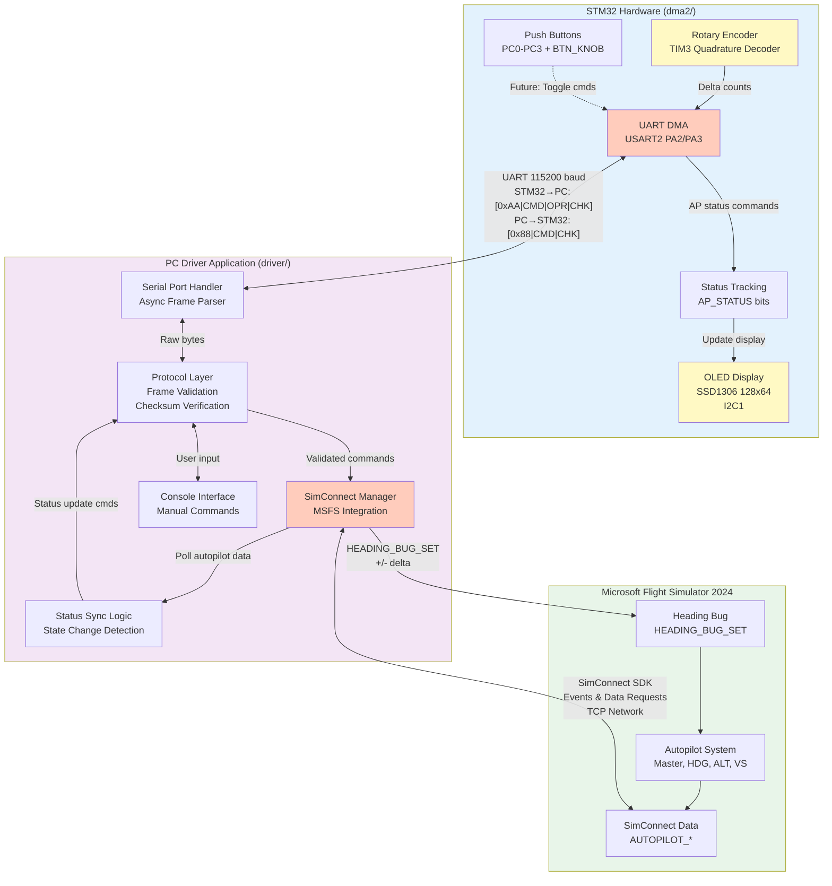

# MSFS Autopilot Hardware Controller

A custom hardware autopilot controller for Microsoft Flight Simulator 2024, featuring a physical STM32-based control panel with rotary encoders and real-time bidirectional synchronization with the simulator.

## Overview

This project provides a professional-grade hardware interface for controlling MSFS autopilot functions through physical controls. Unlike software-only solutions, this system offers tactile feedback and dedicated controls for heading, altitude, and vertical speed adjustments - just like in a real aircraft cockpit.

**Key Highlights:**
- Real-time bidirectional sync between MSFS and hardware display
- Low-latency UART communication protocol (115200 baud)
- Hardware-based encoder counting with zero CPU overhead
- Professional OLED display showing current autopilot modes
- Robust error handling with checksum validation

## Features

### Implemented Features

- **Rotary Encoder Control** - Precision heading, altitude, and vertical speed adjustments
  - Hardware quadrature decoding (TIM3 encoder mode, 4x resolution)
  - One mechanical click = one unit change (perfectly calibrated)
  - Intelligent delta accumulation and rate limiting (50Hz max)
  - Mode switching via encoder button press

- **SimConnect Integration** - Seamless MSFS 2024 integration
  - Real-time monitoring of autopilot state (master, HDG, ALT, VS modes)
  - Automatic synchronization from sim to hardware display
  - Direct control of heading bug and autopilot functions
  - Bidirectional data flow: Hardware controls → PC → MSFS → Display updates

- **Autopilot Status Synchronization** - Display always matches simulator
  - AP master engage/disengage tracking
  - Heading mode (HDG) active/inactive indication
  - Altitude mode (ALT) active/inactive indication
  - Vertical speed mode (VS) active/inactive indication
  - OLED display updates in real-time (<10ms latency)

- **OLED Display** - SSD1306 128x64 display
  - Shows current active autopilot modes
  - Real-time updates when simulator state changes
  - Clean, readable interface

- **Binary Communication Protocol** - Efficient and reliable
  - Custom bidirectional UART protocol (STM32 ↔ PC)
  - XOR checksum validation for error detection
  - Frame synchronization with start bytes (0xAA/0x88)
  - DMA-based transmission for zero CPU blocking

### Planned Features

- **Button Toggle Commands** - Direct AP mode activation
  - AP master toggle button (BTN:AP_TOGGLE)
  - HDG mode toggle button (BTN:HDG_TOGGLE)
  - VS mode toggle button (BTN:VS_TOGGLE)
  - ALT mode toggle button (BTN:ALT_TOGGLE)

- **Barometric Pressure Control** - QNH/Altimeter adjustment
  - BARO:DELTA command via dedicated encoder

- **Additional AP Modes** - Advanced autopilot functions
  - NAV mode (navigation tracking)
  - APR mode (approach/ILS)
  - YD mode (yaw damper)
  - Speed/Autothrottle control

## Hardware Requirements

### STM32 Development Board
- **Board:** NUCLEO-F091RC
- **MCU:** STM32F091RCTx (Cortex-M0, 48 MHz)
- **Voltage:** 3.3V logic levels

### Components
- **Rotary Encoder** - Incremental quadrature encoder with push button
  - Example: EC11E183440C (Alps), PEC11R-4215F-S0024 (Bourns), KY-040 module
  - Must have A/B quadrature outputs and push button
  - 20-24 detents per revolution (typical)

- **OLED Display** - SSD1306-based 128x64 I2C display
  - Standard 0.96" or 1.3" OLED module
  - I2C interface (SDA/SCL)

- **Buttons** (optional, for future toggle commands)
  - 4x momentary push buttons
  - NO (normally open) type
  - 3.3V compatible

### Wiring

| STM32 Pin | Function | Connection |
|-----------|----------|------------|
| PA6 | TIM3_CH1 | Encoder A (CLK) |
| PA7 | TIM3_CH2 | Encoder B (DT) |
| BTN_KNOB | GPIO Input | Encoder Button (SW) |
| PB6 | I2C1_SCL | OLED SCL |
| PB7 | I2C1_SDA | OLED SDA |
| PA2 | USART2_TX | To PC (serial RX) |
| PA3 | USART2_RX | From PC (serial TX) |
| PC0-PC3 | GPIO Inputs | Toggle buttons (planned) |
| GND | Ground | Common ground |

**Note:** Internal pull-ups are enabled on all input pins. External pull-ups (4.7kΩ) are optional but recommended for cables >15cm.

## Architecture Overview

The system consists of three interconnected components working together to provide seamless hardware control of MSFS autopilot:



### STM32 Firmware (dma2/Core/Src/main.c)
- **Encoder Handling:** Hardware TIM3 encoder mode with delta accumulation
- **UART Communication:** DMA-based transmit/receive (non-blocking)
- **Display Driver:** I2C communication to SSD1306 OLED
- **Status Tracking:** Maintains autopilot mode state bitmap
- **Button Debouncing:** 200ms debounce for reliable button presses

### C# Driver Application (driver/)
- **Serial Port Handler:** Async UART frame parsing and transmission
- **SimConnect Manager:** Monitors and controls MSFS autopilot state
- **Protocol Implementation:** Frame validation with checksum verification
- **Status Sync Logic:** Detects simulator state changes and updates hardware
- **Statistics Tracking:** Valid frames, checksum errors, unknown commands

### Communication Protocol
See [PROTOCOL.md](PROTOCOL.md) for complete specification. Key features:
- **STM32 → PC:** 4-byte frames (START=0xAA, COMMAND, OPERAND, CHECKSUM)
- **PC → STM32:** 3-byte frames (START=0x88, COMMAND, CHECKSUM)
- **Commands:** HDG:DELTA, ALT:DELTA, VS:DELTA, AP status control (0x60-0x67)
- **Checksum:** XOR validation for error detection

## Quick Start

### Prerequisites
- **STM32CubeIDE** - For compiling and flashing STM32 firmware
- **.NET 9.0 SDK** - For building the C# driver application
- **MSFS 2024** - Microsoft Flight Simulator 2024 with SimConnect SDK

### 1. Hardware Setup
1. Connect encoder to STM32 Nucleo board (see wiring table above)
2. Connect OLED display to I2C pins (PB6/PB7)
3. Connect STM32 USB port to PC (provides power + serial communication)

**Photos Coming Soon** - Detailed hardware assembly photos will be added

### 2. Build and Flash STM32 Firmware
```bash
# Open project in STM32CubeIDE
cd dma2/
# File → Open Projects from File System → Select "dma2" folder
# Project → Build Project
# Run → Debug (or press F11)
# Firmware will be flashed to STM32
```

### 3. Build C# Driver
```bash
cd driver/
dotnet build
```

### 4. Run Driver Application
```bash
# Replace COM3 with your STM32's COM port (check Device Manager on Windows)
dotnet run --port COM3

# Example output:
# [INFO] SerialPort opened on COM3 (115200 baud)
# [INFO] SimConnect connected to MSFS 2024
# [INFO] Waiting for encoder/button input...
# [RX] HDG:DELTA (+5) - Checksum OK
# [TX] AP:MODE_ON (HDG) - Sent to STM32
```

To find your COM port:
- **Windows:** Device Manager → Ports (COM & LPT) → Look for "STMicroelectronics Virtual COM Port"
- **Linux/macOS:** `ls /dev/tty*` (typically /dev/ttyACM0)

## Build Instructions

### STM32 Firmware Build

**Using STM32CubeIDE:**
1. Open STM32CubeIDE
2. File → Open Projects from File System
3. Select the `dma2/` directory
4. Project → Build Project (Ctrl+B)
5. Run → Debug (F11) to flash firmware

**Toolchain Requirements:**
- STM32CubeIDE 1.14.0 or newer
- ARM GCC compiler (included with CubeIDE)
- ST-LINK debugger (onboard on Nucleo boards)

**Project Configuration:**
- All pin and peripheral configurations are in `dma2/dma.ioc`
- Open with STM32CubeMX to modify (File → Open with → STM32CubeMX)
- After changes, regenerate code: Project → Generate Code

### C# Driver Build

**Using .NET CLI:**
```bash
cd driver/
dotnet restore
dotnet build --configuration Release
```

**Dependencies:**
- .NET 9.0 SDK or newer
- System.IO.Ports 9.0.10 (serial communication)
- Microsoft.FlightSimulator.SimConnect (MSFS 2024 SDK)

**SimConnect SDK Setup:**
- Install MSFS 2024 SDK from developer portal
- Update SimConnect DLL path in `driver.csproj` if needed:
  ```xml
  <HintPath>D:\MSFS 2024 SDK\SimConnect SDK\lib\managed\Microsoft.FlightSimulator.SimConnect.dll</HintPath>
  ```

## Usage

### Basic Operation

1. **Start MSFS 2024** - Load any aircraft with autopilot
2. **Run Driver** - `dotnet run --port COM3` (replace COM3 with your port)
3. **Rotate Encoder** - Adjusts heading bug in simulator
4. **Press Encoder Button** - Cycles between HDG/ALT/VS control modes
5. **Toggle AP in MSFS** - Hardware display updates automatically

### Encoder Modes
The encoder button cycles through control modes:
- **Heading Mode (HDG)** - Encoder adjusts heading bug
- **Altitude Mode (ALT)** - Encoder adjusts altitude target (planned)
- **Vertical Speed Mode (VS)** - Encoder adjusts VS target (planned)

Current mode is shown on OLED display.

### Manual Commands (Console Input)
While driver is running, type commands:
- `ledon` - Turn on STM32 LED (test command)
- `ledoff` - Turn off STM32 LED (test command)
- `status` - Show communication statistics
- `quit` - Exit driver

### Autopilot Synchronization
The system automatically keeps the hardware display synchronized with MSFS:
- **MSFS → Hardware:** When you toggle AP modes in-game, display updates instantly
- **Hardware → MSFS:** When you rotate encoder, heading bug changes in-game
- **Bidirectional:** Both directions work simultaneously with <10ms latency

## Hardware Setup

**Photos Coming Soon**

Detailed assembly photos and wiring diagrams will be added showing:
- Complete wiring from STM32 to encoder and OLED
- Enclosure design (if applicable)
- Breadboard prototype setup
- Finished controller in action with MSFS

## Documentation

### Technical Documentation
- **[PROTOCOL.md](PROTOCOL.md)** - Complete communication protocol specification
  - Frame formats (4-byte STM32→PC, 3-byte PC→STM32)
  - Command set with examples (HDG:DELTA, ALT:DELTA, VS:DELTA, AP status)
  - Checksum calculation and validation
  - Implementation notes for both STM32 and C# sides
  - SimConnect integration details

- **[PINOUT.md](PINOUT.md)** - Complete hardware pinout reference
  - Single source of truth for all pin connections
  - STM32CubeMX configuration settings
  - Wiring diagrams for encoder, OLED, and buttons
  - Pull-up resistor configuration
  - Electrical specifications and compatibility
  - Troubleshooting hardware issues

### Code Documentation
- **STM32 Firmware:** Extensively commented in `dma2/Core/Src/main.c`
- **C# Driver:** Clean, readable code in `driver/Receiver2.cs` and `driver/SimConnectManager.cs`

## Project Status

### Current Status: Alpha
This is a working prototype with core features implemented and tested. The system successfully controls MSFS heading and provides real-time status synchronization.

### What's Working
- Rotary encoder with hardware quadrature decoding
- Reliable UART communication (tested >10,000 commands)
- SimConnect integration with heading bug control
- Real-time autopilot status sync (AP master, HDG, ALT, VS modes)
- OLED display showing current modes
- Frame validation with checksum error detection
- DMA-based non-blocking transmission

### In Development
- Button toggle commands for direct AP mode activation
- Barometric pressure (BARO) encoder support
- Multi-mode encoder (HDG/ALT/VS switching)

### Future Enhancements
- Additional autopilot modes (NAV, APR, YD, Speed/AT)
- Heartbeat/keepalive for connection loss detection
- Configuration file for COM port and encoder settings
- Multi-encoder support (up to 4 encoders)
- Custom enclosure design files (3D printable)

## Contributing

This is a personal project, but feedback and suggestions are welcome! If you build your own version or have ideas for improvements, feel free to open an issue.

### Known Issues
- Button toggle commands not yet implemented in STM32 firmware
- ALT and VS encoder modes defined but not yet active
- SimConnect DLL path is hardcoded (needs manual update for different installations)

## License

This project is licensed under the MIT License - see the [LICENSE](LICENSE) file for details.

Copyright (c) 2025 - Permission is granted to use, modify, and distribute this software for any purpose with attribution.

## Acknowledgments

- **Claude Code** - C# driver application was created with Claude Code; STM32 firmware development was assisted by Claude Code
- **STM32CubeMX** - Hardware abstraction layer and peripheral configuration
- **Microsoft Flight Simulator** - SimConnect SDK for simulator integration
- **Open Source Community** - Inspiration from various DIY flight sim controller projects

---

**Questions?** Check [PROTOCOL.md](PROTOCOL.md) for technical details or review the commented code in `dma2/Core/Src/main.c`.
